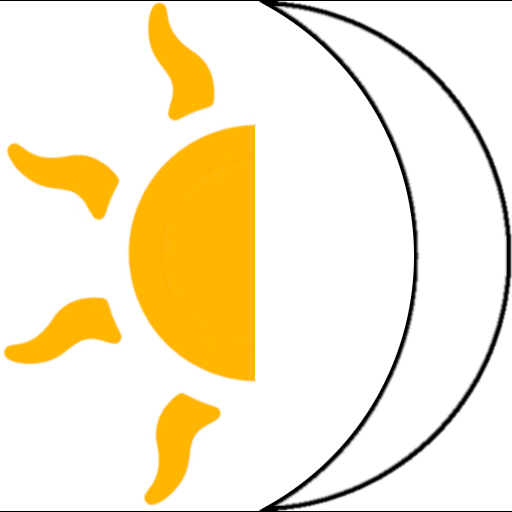

#  Aurora — Colour Grading for Owlbear Rodeo

**Aurora** lets you transform the mood of your maps with real-time colour grading — right inside Owlbear Rodeo. Desaturate a dungeon into gloomy shadow, bathe a tavern in golden hour warmth, or wash a battlefield in eerie moonlight. It's all done with a GPU shader that runs directly on your map, so there's no image editing, no re-uploading, and changes happen instantly.

Aurora gives you four intuitive controls:

- **Saturation** — boost or drain the colour intensity of your map
- **Lightness** — brighten a sun-drenched scene or darken a cave
- **Hue** — overlay a colour tint (red for a burning city, blue for an underwater temple…)
- **Opacity** — control how strong that tint is, from a subtle wash to a bold colour shift

Mix and match these to create exactly the atmosphere you're after, then save your favourites as presets that persist across every scene in the room.

---

## Getting Started

### 1. Install the Extension

Copy the Aurora manifest URL:

```
https://aurora-0nm6.onrender.com/manifest.json
```

Then head to your **Owlbear Rodeo profile** → **Extensions** → **Add Extension**, paste the URL, and confirm.

> ![Screenshot placeholder: Adding the manifest URL in the Owlbear Rodeo extension manager]

### 2. Enable Aurora in Your Room

Open the room where you want to use Aurora. Go to the **Extensions** panel and make sure Aurora is **toggled on** for that room. You should see the  Aurora icon appear in the top-left extension tray.

> ![Screenshot placeholder: Enabling Aurora in the room's extension list]

---

## Applying an Effect

### 3. Add Aurora to a Map Item

Right-click any item on the **Map layer** and choose **Add Aurora** from the context menu. That's it — the shader is now attached and ready to configure!

> ![Screenshot placeholder: Right-clicking a map image and selecting "Add Aurora"]

**💡 Pro tip:** Want to affect multiple map tiles with a single effect? Draw a large rectangle on the **Drawing** layer, move it to the **Map** layer, then add Aurora to that rectangle. The shader covers the full area of whatever item it's attached to, so one big shape can colour-grade your entire scene in one go.

### 4. Adjust the Settings

After adding Aurora, right-click the same item again and choose **Aurora Settings**. This opens the HSLO control panel where you can tweak all four sliders and see changes in real time.

> ![Screenshot placeholder: The Aurora Settings popover with sliders]

---

## Working with Presets

Presets are a huge time-saver. Aurora ships with **four built-in presets** to get you started:

| Preset | Vibe |
|--------|------|
| **Midnight** | Deep desaturation with a cool blue-purple wash — perfect for nighttime encounters |
| **Golden Hour** | Warm, slightly darkened tones with a golden tint — great for sunset scenes |
| **Pre-Dawn** | Dimmed with a deep blue overlay — that quiet moment before the sun rises |
| **Blood Moon** | Heavily desaturated and darkened with a red tint — ominous and foreboding |

Plus there are two empty slots ready for your own creations.

### 5. Load a Preset

In the **Aurora Settings** popover, use the **Load Preset…** dropdown to pick any saved preset. The sliders snap to those values instantly — it's a great way to audition different moods or use a preset as a starting point before fine-tuning.

> ![Screenshot placeholder: Selecting a preset from the dropdown]

### 6. Toggle the Effect On and Off

Use the **Enabled** toggle at the top of the Aurora Settings panel to flip the shader on and off without losing your slider positions. This is really handy for comparing the "before and after" — toggle it a few times and you'll immediately see how much atmosphere the effect adds.

> ![Screenshot or short recording placeholder: Toggling the effect on and off to compare]

### 7. Save Your Own Presets

Happy with your settings? Hit **Save Current As…** to store them. You can:

- **Pick a slot** — Aurora will auto-select the first empty slot, but you can choose any of the six
- **Overwrite an existing preset** — just select an occupied slot and confirm
- **Name it** — give your preset a memorable name (up to 16 characters)

Presets are stored in the **room metadata**, so they're shared with every player in the room and persist across sessions and scenes.

> ![Screenshot placeholder: The Save dialog with slot selection and name input]

---

## Managing Presets

### 8. The Action Popover (Preset Library)

Click the ** Aurora** icon in the top-left extension tray to open the Action popover. This shows your **Preset Library** — a grid of all six preset slots with their names and current values.

From here you can get an overview of everything you've saved, and manage your library without needing to have a map item selected.

> ![Screenshot placeholder: The Action popover showing the Preset Library grid]

### 9. Rename or Clear Presets

At the top of the Preset Library you'll find two buttons:

- **Rename** — click it, then click any occupied preset to give it a new name
- **Clear** — click it, then click any occupied preset to empty that slot

Both modes highlight the valid targets so you know exactly what you're clicking. Click the mode button again (or perform the action) to exit the mode.

> ![Screenshot placeholder: Rename mode active with presets highlighted in blue]

---

## Removing Aurora

### 10. Remove the Effect Entirely

If you want to completely remove Aurora from a map item, open **Aurora Settings** and click the red **Remove Aurora** button at the bottom.

⚠️ **This deletes the shader and all its settings from that item.** If you just want to temporarily turn the effect off while keeping your slider values intact, use the **Enabled** toggle instead — that way your settings are still there when you switch it back on.

> ![Screenshot placeholder: The Remove Aurora button at the bottom of the settings panel]

---

## Need Help?

If you run into any issues, have a feature request, or just want to share the cool scenes you've created with Aurora, come find us on Discord:

👉 **[Join the Owlbear Rodeo Discord](https://discord.gg/u5RYMkV98s)**

We'd love to hear how you're using Aurora at your table. Happy grading! 🎨
